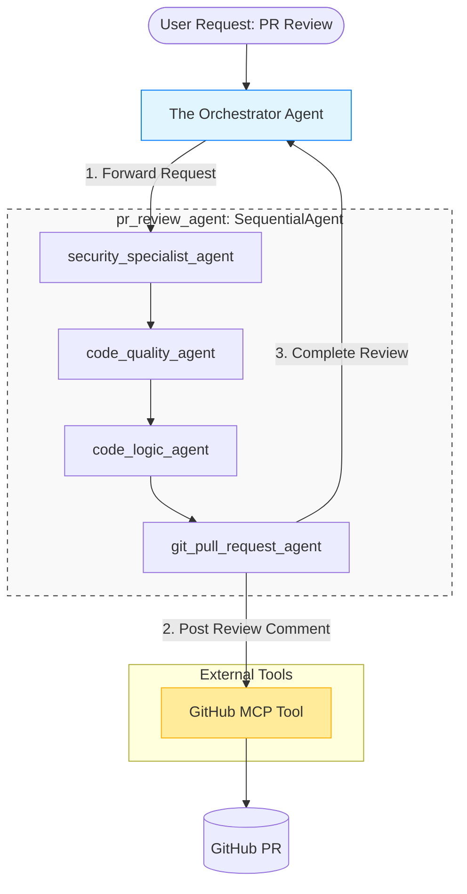
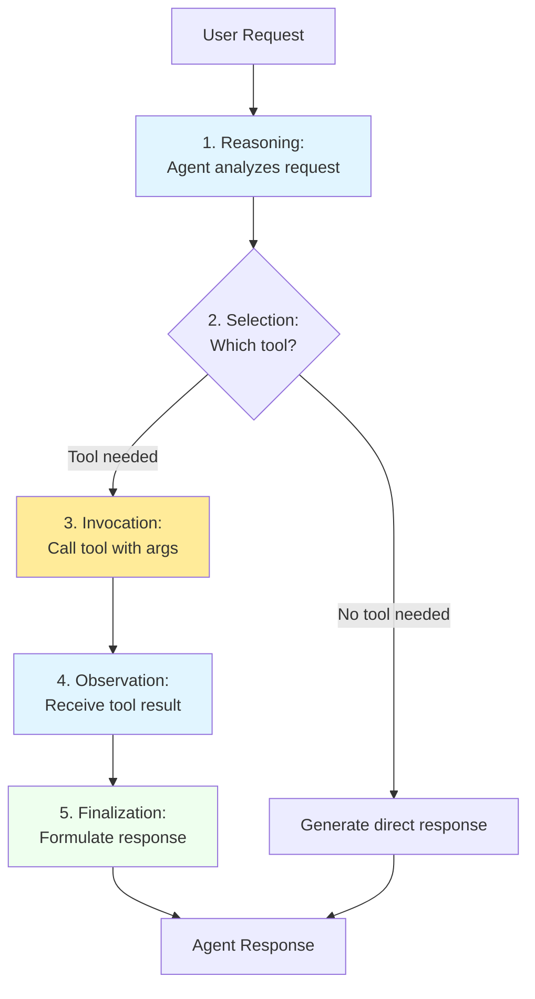
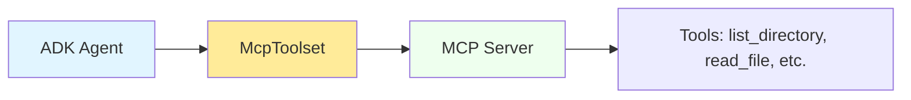

## **Google ADK**
### **What is Google ADK?**
ADK is open sourced framework for developing agents which works with all the ppopular LLM models. It is also available in multiple languages like python, java and go. Using ADK you can create a multi-agent architecture where the primary agent can delegate the tasks to more specialized agents. You can also create agent workflows with agents in a parallel, sequencial or loop workflow. These agents can also use equiped with tools both pre-build as well as custom tools and MCP. ADK support other popular frameworks like LangChain and protocols like A2A.
### **Setup**
We will be using python as our language of choice. ADK need `Python 3.11+` . Check your python version, if not available download it from [here](https://www.python.org/downloads/)

For python setup, open a terminal and 

```shell
mkdir agent-workspace
cd agent-workspace
# create a workspace folder and cd into it

python --version
# or python3 --version, expected output python 3.11.x or higher

python -m venv .venv
# create a virtual environment to isolate your project dependencies from the system installation.

source .venv/bin/activate # on mac
# on windows use .venv\Scripts\Activate.ps1 , this would activate the virtual environment
# if your terminal prompt starts with (.venv) now, you know that the virtual environment is activated

pip install google-adk
# this would install the adk framework, the adk cli and the dependent packages

adk --version
# should show version number like 1.0.0 or higher
```

Next you need the API key for your agent to call the LLM. Here we are going to use Google's Gemini models.
The simplest way to access Gemini is via Google AI Studio. For that you 
+ Visit [Google AI Studio](https://aistudio.google.com/apikey)
+ Sign in with your Google account
+ Click Create API Key
+ Copy the API key (it looks like `AIzaSyB.....`) and keep it safe.We will need it in the next step.

This is the quickest way where you also get the free tier benefits and hence works best for learning. But if you are looking for production setup, you would be doing it using `Google Cloud Vertex AI`

> For this POC `google-adk 1.31.1` and `Python 3.12.3` was used

### **A Simple Example Agent**
Before jumping into our use case, lets try a simple example.

```shell
adk create sample_agent

# the above adk cli command should create the below files in the current directory
sample_agent/
 ├── agent.py      # Main agent code (you’ll edit this)
 ├── __init__.py   # Python package initialization
 └── .env          # Environment variables (you’ll edit this next)
```

The `agent.py` is where you define your agent. Always assign your main agent to a variable named `root_agent` as ADK command-line tools look for a Python variable named root_agent as the entry point to your agent system. This is a convention that allows ADK to discover and run your agent.

```python
from google.adk.agents.llm_agent import Agent

root_agent = Agent(
    model='gemini-2.5-flash',
    # Model(Required): The LLM, the reasoning engine
    name='math_tutor_agent',
    # Identity(Required): Identifier for the agent. In a multi agent systems agents refer each other using this
    description='Helps students learn algebra by guiding them through problem solving steps.',
    # Purpose(Optional): A summary of what this agent does. 
    # Used by other agents to determine if they should route a task to this agent
    instruction='You are a very patient mathematics tutor. Your job is to help students in solving their algebra problems.',
    # Behavior(Optional but critical): The goal of the agent and how it should act
)
```

The `__init__.py` is a the python package initialization file that imports your agent module. This is required for ADK to discover your agent
```python
from . import agent
```

The `.env` file is the python environment file to place your environment variables.  Paste the API key that you created during the setup step. ADK would automatically load the environment varaiblesfrom  this file.
```python
GOOGLE_GENAI_USE_VERTEXAI=0  #if you created the API key from Google AI Studio. 
#If you use Vertex AI, this should be set to 1 and also provide GOOGLE_CLOUD_LOCATION and GOOGLE_CLOUD_PROJECT
GOOGLE_API_KEY=AIz.... # paste your API key here
```

If all the above steps are done, now its time to bring the agent to life. To keep it simple, we will use the ADK web interface to run the agent for now. 
```shell
adk web  # run this from the sample_agent directory
```
There are other options as well to run your agent  
`adk run` – Interact with your agent directly from the terminal, without opening a web browser.  
`adk api_server` – runs your agent as a REST API service. Other applications acn send requests to your agent over HTTP  
It is also possible to use the agent in a progammatic way directly from your python code for eample from your Jupyter notebook, data processing pipeline etc.

We will stck to `adk web` for now. With this, you should see the below output in the console
```shell
INFO:     Started server process
INFO:     Waiting for application startup.
INFO:     Application startup complete.
INFO:     Uvicorn running on http://127.0.0.1:8000 (Press CTRL+C to quit)
```
Open the link in a browser and you can interact with your agent with this interface. You may need to select your agent from the left side dropdown.

### **What you have seen so far**
`Agent = model + tools + orchestration`  
`model` is an LLM which acts as the brain of your agent  
`tools` are unctions that your agent can call to take actions. These bridge “knowing” to “doing”  
`orchestration` manages the whole process of *perceive → think → act → check → repeat*


## **Our Use Case : Automated PR Reviewer**
We would be building a PR review agent using Google ADK. Instead of a single bot giving a generic response, we will create multiple specialized agents working together and reviewing the code from different angles. Its like a code `Review Board` of security specialist, performance experts, documentaion and best practices experts.


### **The Orchestrator Agent**
The orchestrator agent which integrate the other specialized sub-agentsand and the Github MCP tools.It pulls PR diff and delegates the reviw task to the specialists.
```python
import os

from google.adk.agents import Agent
from google.adk.tools.mcp_tool import McpToolset
from google.adk.tools.mcp_tool.mcp_session_manager import StreamableHTTPConnectionParams

from .revieweragent import review_agent

GITHUB_TOKEN = os.environ['GITHUB_TOKEN']

root_agent = Agent(
    model="gemini-3-flash-preview",
    #model='gemini-2.5-flash',
    name="github_expert_agent",
    description="Main entry point for Git/GitHub tasks and PR reviews.",
    instruction="""
    You are a GitHub specialist. For all the git tool calls use rphukan as the username
        * CRITICAL: You ONLY have access to the following github tools: ["add_comment_to_pending_review","list_pull_requests","pull_request_read","pull_request_review_write","search_pull_requests","update_pull_request","search_repositories"]. Do not attempt to use any other tool names.
        * For PRs You ONLY have access to the following github tools ["add_comment_to_pending_review","list_pull_requests","pull_request_read","pull_request_review_write","search_pull_requests","update_pull_request","search_repositories"]. Do not attempt to use any other tool names.
        * For reviewing a PR, first fetch the diff using your tool "pull_request_read". 
        * Delegate the diff to 'review_agent' for specific checks.
    """,
    sub_agents=[review_agent],
    tools=[
        McpToolset(
            connection_params=StreamableHTTPConnectionParams(
                url="https://api.githubcopilot.com/mcp",
                headers={
                    "Authorization": f"Bearer {GITHUB_TOKEN}",
                    "X-MCP-Toolsets": "repos,pull_requests",
                    "Accept": "application/json, text/event-stream"
                },
            )
        )
    ],
)
```
Important points from the above code
#### **Tools and MCP**
*In the context of ADK, a tool represents a specific capability provided to an AI agent, enabling it to perform actions and interact with the world beyond its core text generation and reasoning abilities.*
Tools execute a specific, developer-defined logic. The LLM reasons and decides when and which tool to use and what are going to be the inputs to the tool. The LLM uses the tool names, descriptions (from docstrings or the description field), and parameter schemas to decide which tool to call based on the conversation and its instructions. The tool then executes its designated function. 
In general the whole process looks like below

* Step 1 - Reasoning: The agent’s LLM analyzes its system instruction, conversation history, and user request.
* Step 2 - Selection: All the tools available to the LLM and there descriptions were already provided to the LLM. Hence based on step 1 analysis the LLM can decide which tool to use.
* Step 3 - Invocation: The LLM generates the required arguments (inputs) for the selected tool and triggers its execution.
* Step 4 - Observation: The agent receives the output (result) returned by the tool.
* Step 5 - Finalization: The agent incorporates the tool’s output into its ongoing reasoning process to formulate the next response, decide the subsequent step, or determine if the goal has been achieved.


These tools can be   
`Function Tools` - tools that you write yourself   
`Built-in Tools` - tools in-built in ADK    
`Tird-party Tools` - tools provided by third parties, MCP tools that we have used above.  

MCP (Model Context Protocol) is an open standard created by Anthropic. It allows AI agents to connect to external tool servers through a universal protocol. In our case we have USED the GitHub MCP Servers. Here our  ADK agent acts as an MCP client, consuming the Git tools from the external GitHub MCP servers.

MCP servers expose tools via the standardized MCP protocol. The ADK agents connect to servers using McpToolset. These Tools are discovered automatically and agent uses these tools exactly like any other ADK tool.

### **The PR Reviewer Agent**
The `PR Reviewer Agent` is a `SequentialAgent` comprised of `Security Specialist Agent`, `Code Quality Agent`, `Code Logic Agent` and `Git Pull Request Agent` working in a sequence. The feedbacks are passed-on from the code reviewer agents to the final `Git Pull Request Agent` using the ADK provided session state - a dictionary your code can read and write programmatically like

```python
ctx.session.state['<namespaces>:<variable_name>'] = some value
ctx.session.state.get('<namespaces>:<variable_name>', '<default value>')
```

State namespaces are  
- `temp` - Temporary data, discarded after turn
- No prefix - Session data, discarded after conversation ends
- `user` - User preferences, persists across all sessions
- `app` - Global


#### Security Specialist Agent
The security specialist agent focusing on the security aspects of the code.
```python
from google.adk.agents import Agent

security_specialist_agent = Agent(
    model="gemini-3-flash-preview",
    name="security_specialist",
    description="Handles deep security analysis, vulnerability detection, and secret scanning.",
    instruction="""
    You are a software security specialist. Scan the provided git code diff for security risks. Provide specific file and line numbers for issues.
    You can look for below securities issues in the code.
        1. SQL injections
        2. OWASP issues
    """
)

```
`output_key` - If provided the final response of the agent will be automatically saved to the session state under this key. Using this we will pass the review comments of our code reviewer agents to the final agent for consolidation and PR update. 


#### Code Quality Agent
The code quality agent checking the coding best practices etc.
```python
from google.adk.agents import Agent

code_quality_agent = Agent(
    model="gemini-3-flash-preview",
    name="code_quality_expert",
    description="Analyzes code quality, coding best practices, and code documentation related problems.",
    instruction="""
    You are an expert senior software engineer. Review the provided Git PR diff for code quality, coding best practices, and code documentation related problems.
    
    For coding best practices you can check the below
        1. naming conventions
        
    For code quality you can look for below problems
        1. The function/method lengths should not be very long
        2. Check for potential bugs 
        
    From documentation perspective, you can look for below things
        1. there are sufficient meaningful comments in the code
        2. there are logging with correct log levels       
    """
)


```
#### Code Logic Agent
The expert coder checking code logic, performance bottleneck etc.
```python
from google.adk.agents import Agent

code_logic_agent = Agent(
    model="gemini-3-flash-preview",
    name="code_logic_expert",
    description="Analyzes code logic, performance, and potential runtime errors.",
    instruction="""
    You are an expert senior software engineer. Review the code for logical correctness and performance bottlenecks. Make sure that
        1. the code logic is correct. 
        2. there are no performance bottlenecks
        3. there are no infinite loops
        4. Checks for algorithmic efficiency
    """
)

```

#### Git Pull Request Agent
The final agent in the sequence would consolidate all the review comments and update the PR with the comments
```python
import os

from google.adk.agents import Agent
from google.adk.tools.mcp_tool import McpToolset
from google.adk.tools.mcp_tool.mcp_session_manager import StreamableHTTPConnectionParams

GITHUB_TOKEN = os.environ['GITHUB_TOKEN']

git_pull_request_agent = Agent(
    model="gemini-3-flash-preview",
    name="git_pull_request_agent",
    description="Agent who create a Github pull request review comment",
    instruction="""
    You are a Git and GitHub specialist. Your job is to create a pull request review comment using the available tools.

    Tool Selection Guide:
    - For all the git tool calls use 'rphukan' as the username.
    - You ONLY have access to the following github tools, "add_comment_to_pending_review","list_pull_requests","pull_request_read",
      "pull_request_review_write","search_pull_requests","update_pull_request","search_repositories", "create_pull_request_review". Do not attempt to use any other tool names.

    Steps for posting the PR review comment
    1. consolidate the review comments from {security_review_comments?}, {quality_review_comments?} and {logic_review_comments?} to a single line by line review comment
    2. use the consolidated review and use the tool "create_pull_request_review" to post the review comment.

    """,

    tools = [
        McpToolset(
            connection_params=StreamableHTTPConnectionParams(
                url="https://api.githubcopilot.com/mcp",
                headers={
                    "Authorization": f"Bearer {GITHUB_TOKEN}",
                    "X-MCP-Toolsets": "pull_requests",
                    "Accept": "application/json, text/event-stream"
                }
            ),
            tool_filter=[
                "add_comment_to_pending_review",
                "list_pull_requests",
                "pull_request_read",
                "pull_request_review_write",
                "search_pull_requests",
                "update_pull_request",
                "create_pull_request_review"
            ],
        )
    ]
)

```


### Putting it all together
#### run from terminal
```shell
#Step 1
adk run github_agent
```
#### run as API
```shell
#Step 1
adk api_server github_agent

#Step 2
curl -X POST http://localhost:8000/
your-endpoint -H "Content-Type: application/json" -d \
'{"message": "is there any pending PR in the rphukan/agentic-ai-samples repository"}'
```
### What you can do next
*  Integrate the agent with GitHub Actions to trigger the review when a new PR is opened or updated.

## Referrences