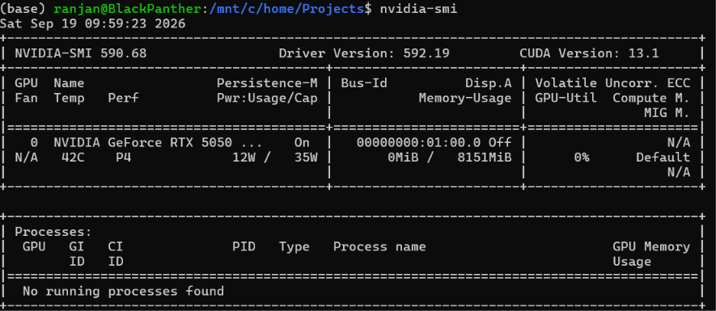

# Running Stable Diffusion Locally
### 1. Introduction
Wanted to test the RTX 5050 (8 GB) GPU on my laptop. So thought of running a Stable Diffusion Model for image generation. Since I was exploring TensorFlow for sometime, picked up this guide [High-performance image generation using Stable Diffusion in KerasCV](https://www.tensorflow.org/tutorials/generative/generate_images_with_stable_diffusion) for a step by step guidance.

### 2. Stable Diffusion
We will use the KerasCV implementation of the [Stable Diffusion Model](https://github.com/CompVis/stable-diffusion). Stable Diffusion is an open-source text-to-image model which generate images based on a text prompt. 

[KerasCV](https://github.com/keras-team/keras-cv) is an extension of the Keras API which contains a library of modular computer vision components that work natively with TensorFlow. These APIs are used in common computer vision tasks such as data augmentation, classification, object detection, segmentation, image generation, and more. Refer the [Keras Documentaion](https://keras.io/getting_started/) for more details.

### 3. Local Setup
If you are trying this on a Windows machine like me, very soon you will see the below warning 
```shell    
TensorFlow GPU support is not available on native Windows for TensorFlow >= 2.11. Even if CUDA/cuDNN are installed, GPU will not be used. Please use WSL2 or the TensorFlow-DirectML plugin.
```
The warning you are seeing means that TensorFlow cannot use your GPU because native Windows support for GPUs was dropped starting with TensorFlow 2.11. Your code will still run, but it will execute on your CPU, which will make running Stable Diffusion incredibly slow.To enable GPU acceleration on Windows for TensorFlow 2.11 or newer, you have two primary solutions.

* `Use Windows Subsystem for Linux (WSL2)` - This is the official and most performant way to run modern TensorFlow with GPU support on Windows. It runs a lightweight Linux environment inside Windows where TensorFlow GPU support is fully functional.

* `Downgrade TensorFlow to 2.10` - If you want to keep running everything natively on Windows without dealing with WSL2, you can downgrade TensorFlow to the last version that natively supported Windows GPUs. Though I would not recommend this and I did not try this.

#### 3.1. WSL2 - Windows Subsystem for Linux
If you dont have WSL2 already installed, open PowerShell as Administrator and run the below command to Install WSL2 
```shell
wsl --install
```
Restart your computer when prompted. Next you will need to set up your username and password in the Linux terminal that pops up.

Your Windows files are completely accessible from inside WSL2. Your Windows C: drive is mounted under /mnt/c/.

#### 3.2. Python
Next we will need to setup Python and we will use Conda here for our Python setup. 
```shell
# install wget if mising
sudo apt update && sudo apt install wget -y

# download miniconda installer
wget https://repo.anaconda.com/miniconda/Miniconda3-latest-Linux-x86_64.sh

# runn the installer
bash Miniconda3-latest-Linux-x86_64.sh

# To make the conda command active, close your Ubuntu window and reopen it, or simply run
source ~/.bashrc

# create a new environment with Python 3.11
conda create --name diffusion_env python=3.11 -y

# activate the virtual environment
conda activate diffusion_env
```

#### 3.3. Setup Jupyter Notebook
Next we will setup Jupyter notebook to run this lab 
```shell
# activate the virtual environment
conda activate diffusion_env

# install jupyter notebook and the other packages
conda install -c conda-forge notebook ipykernel ipywidgets matplotlib -y

# create the Notebook Kernel
python -m ipykernel install --user --name=diffusion_env --display-name "Python 3.11 (Diffusion)"

```
Because Jupyter is running inside a lightweight Linux terminal (WSL2), it doesn't have a built-in desktop browser (like Chrome or Edge) to launch automatically. Simply open your regular Windows web browser (Chrome, Edge, Firefox) and manually copy and paste one of the URLs from your terminal output into the address bar.


#### 3.4. Setup for the lab
Next we will need to install tensorflow and its compatible CUDA packages. CUDA and cuDNN are deep learning software packages created by NVIDIA that massively accelerate Python code by running it on a graphics card (GPU) instead of the computer's main processor (CPU).
* `CUDA (Compute Unified Device Architecture)` - CUDA is a software platform that unlocks the GPU for general-purpose mathematical computing. It allows programming languages like Python or C++ to talk directly to the thousands of tiny calculation cores inside an NVIDIA GPU.Without CUDA, libraries like PyTorch or TensorFlow cannot access your GPU's hardware acceleration.
* `cuDNN (CUDA Deep Neural Network library)` - It sits on top of CUDA and provides highly tuned implementations for standard deep learning routines. It includes pre-written, hyper-optimized code for building blocks like forward/backward passes, convolutions (CNNs), pooling, and activation functions. While CUDA gives you the ability to use the GPU, cuDNN ensures that your specific AI operations run at absolute peak physical performance. NVIDIA engineers constantly update cuDNN so that popular AI architectures execute as fast as possible on their latest microarchitectures.
```shell
┌────────────────────────────────────────────────────────┐
│     Your Python Code (e.g., PyTorch / TensorFlow)      │
└───────────────────────────┬────────────────────────────┘
                            │ (Calls AI operations)
┌───────────────────────────▼────────────────────────────┐
│      cuDNN (Pre-optimized deep learning formulas)       │
└───────────────────────────┬────────────────────────────┘
                            │ (Translates to hardware tasks)
┌───────────────────────────▼────────────────────────────┐
│         CUDA (The underlying GPU computing engine)     │
└───────────────────────────┬────────────────────────────┘
                            │ (Sends raw mathematical instructions)
┌───────────────────────────▼────────────────────────────┐
│             NVIDIA GPU Hardware (Graphics Card)        │
└────────────────────────────────────────────────────────┘

```
I used the below compatible versions
```shell
# activate the virtual environment
conda activate diffusion_env

# install the below stable pacjages
pip install tensorflow==2.15.0
pip install nvidia-cudnn-cu12==8.9.2.26 nvidia-cuda-runtime-cu12==12.2.140
pip install keras_cv==0.9.0
pip install protobuf==4.25.3
pip install tensorflow-datasets==4.9.3
```

#### 3.5. Verify your Setup
Even though you are inside WSL2 Linux, TensorFlow still needs to talk to your physical graphics card via the Windows host system. So first, let's see if WSL2 can even see your graphics card. Run this command in your Ubuntu prompt:
```shell
nvidia-smi
```
If it displays your graphics card name (as shown below for my case), Great! This means your driver mapping is working fine. If it says command not found or gives an error: Your Windows NVIDIA driver might be outdated. Go to your Windows desktop, update your graphics driver to the latest version via GeForce Experience, restart your PC, and try running nvidia-smi again in Ubuntu. This is what you should see after `nvidia-smi`


Now you can check if TensorFlow recognizes your graphics card by running this quick Python snippet:
```python
import tensorflow as tf
print("Num GPUs Available: ", len(tf.config.list_physical_devices('GPU')))
```
If it returns 1, your GPU is ready to accelerate your Stable Diffusion model.

But if you see an error like below
```shell
00:00:1788533551.748693 1756 cudart_stub.cc:31] Could not find cuda drivers on your machine, GPU will not be used.Num GPUs Available: 0E0000
00:00:1788533553.833435 1756 cuda_executor.cc:1737] INTERNAL: CUDA Runtime error: Failed call to cudaGetRuntimeVersion: Error loading CUDA libraries. GPU will not be used.: Error loading CUDA libraries. GPU will not be used.W0000 
00:00:1788533553.833722 1807 cuda_executor.cc:1755] Failed to determine cuDNN version (Note that this is expected if the application doesn't link the cuDNN plugin): INTERNAL: cuDNN error: CUDNN_STATUS_INTERNAL_ERRORW0000 
00:00:1788533553.853371 1756 gpu_device.cc:2365] Cannot dlopen some GPU libraries. Please make sure the missing libraries mentioned above are installed properly if you would like to use GPU. 
```
TensorFlow is looking for the CUDA libraries inside standard system folders instead of your virtual environment folders. We need to inject your Conda environment paths directly into Linux's search directory.
```shell
# Activate your environment (if it isn't already):
conda activate diffusion_env

#  explicitly point Linux to the internal site-packages directories where pip saved the NVIDIA runtime libraries,
mkdir -p $CONDA_PREFIX/etc/conda/activate.d
echo 'export LD_LIBRARY_PATH=$CONDA_PREFIX/lib:$LD_LIBRARY_PATH' > $CONDA_PREFIX/etc/conda/activate.d/env_vars.sh

# Re-activate the environment so the new path settings apply:
conda deactivate
conda activate diffusion_env

```

### 4. Run Stable Diffusion
Now that we have our local setup ready lets get cracking.

#### 4.1. Running it in a notebook
You can [download the notebook from my repo](https://github.com/rphukan/machine-learning-samples/blob/main/notebooks/stable_diffiusion.ipynb) or follow along.

`Step 1` - start a PowerShell and type WSL

`Step 2` - check your available conda environments. It should show the *diffusion_env* that we created

`Step 3` - activate your *conda diffusion_env* jupyter notebook

`Step 4` - start your *jupyter notebook*
```shell
Windows PowerShell
Copyright (C) Microsoft Corporation. All rights reserved.

Loading personal and system profiles took 3082ms.
(base) PS C:\home\Projects> wsl
(base) ranjan@BlackPanther:/mnt/c/home/Projects$ conda env list

# conda environments:
#
# * -> active
# + -> frozen
base                 *   /home/ranjan/miniconda3
diffusion_env            /home/ranjan/miniconda3/envs/diffusion_env

(base) ranjan@BlackPanther:/mnt/c/home/Projects$ conda activate diffusion_env
(diffusion_env) ranjan@BlackPanther:/mnt/c/home/Projects$ jupyter notebook
[I 2026-09-19 17:10:58.655 ServerApp] Jupyter Server 2.21.0 is running at:
[I 2026-09-19 17:10:58.655 ServerApp] http://localhost:8888/tree?token=af0f3ae8da898ebc0041500d75debf49077a711d38848552
[I 2026-09-19 17:10:58.655 ServerApp]     http://127.0.0.1:8888/tree?token=af0f3ae8da898ebc0041500d75debf49077a711d38848552
```
Copy the url from the terminal and open it in a browser. Create a new notebook, select the kernel `Python 3.11 (Diffusion)` that we created before and run the below code step by step.

```python
# import the required packages
import time
import keras_cv
from tensorflow import keras
import matplotlib.pyplot as plt

# construct the model
model = keras_cv.models.StableDiffusion(img_width=512, img_height=512)

# give it a prompt
images = model.text_to_image("photograph of an astronaut riding a horse", batch_size=1)

# plot the generated image
def plot_images(images):
    plt.figure(figsize=(20, 20))
    for i in range(len(images)):
        ax = plt.subplot(1, len(images), i + 1)
        plt.imshow(images[i])
        plt.axis("off")


plot_images(images)

# try an another prompt and plot the generated image
images = model.text_to_image(
    "cute magical flying dog, fantasy art, "
    "golden color, high quality, highly detailed, elegant, sharp focus, "
    "concept art, character concepts, digital painting, mystery, adventure",
    batch_size=1,
)
plot_images(images)

```
If you hae followed it so far, you should see the generated images on your notebook as explained [on the guide](https://www.tensorflow.org/tutorials/generative/generate_images_with_stable_diffusion)

Note that we changed the `batch_size` in our code to `1` from what the guide uses. Using a `batch_size=3` needs more VRAM and you may get an `Out of Memory` error. Give it a try.

Few more things you can do to optimize the memory usage

`Enable Mixed Precision Training / Inference` - By default, TensorFlow uses Float32 (32-bit precision). Switching your code to Float16 (16-bit precision) cuts your memory usage exactly in half with zero noticeable loss in image quality. Add these two lines at the very top of your script or notebook, right after importing TensorFlow:
```python
import tensorflow as tf
from tensorflow.keras import mixed_precision

# Set global policy to float16
policy = mixed_precision.Policy('mixed_float16')
mixed_precision.set_global_policy(policy)
```

`Allow Memory GrowthBy default` - TensorFlow tries to map and lock down almost all available VRAM at startup. If Windows or another app suddenly requests a bit of memory, TensorFlow crashes. Forcing memory growth tells TensorFlow to only allocate VRAM incrementally as needed.Add this right under your imports:
```python
gpus = tf.config.list_physical_devices('GPU')
if gpus:
    try:
        for gpu in gpus:
            tf.config.experimental.set_memory_growth(gpu, True)
    except RuntimeError as e:
        print(e)
```


#### 4.1. Running it with a UI
You can [download the notebook from my repo](https://github.com/rphukan/machine-learning-samples/blob/main/notebooks/stable_diffiusion.ipynb) or follow along.

### 5. Monitor your GPU 
By default, running just nvidia-smi gives you a single, static snapshot of your GPU's current status (like temperature, VRAM usage, and power draw). But if you want to monitor your GPU load and watch it work in real time, you can open a fresh Ubuntu terminal window alongside your notebook and run the command below.  It tells the terminal to refresh and run nvidia-smi every half a second (twice per second). This is very useful when training machine learning models or running heavy CUDA scripts because it lets you see exactly when your GPU usage spikes or drops instantly.

```shell
watch -n 0.5 nvidia-smi
```


